# FermentFreude — User Flow Diagrams

Prepared by Rafaela Studio · 2026-07-09

Twelve diagrams in Mermaid flowchart syntax: eleven detailed flows plus one "map of maps" overview. Each flow uses subgraphs as swimlanes for **Customer, Website (Next.js), Database (Payload/MongoDB), Stripe, Brevo, Admin**.

**Convention:**
- Solid box = confirmed working today
- Dashed orange box, "⚠ known bug" = exists but broken
- Dashed gray box, "🚧 not built yet" = referenced/planned but doesn't work
- Diamond = decision point

Paste any block below into a Mermaid live editor (mermaid.live) or a Mermaid-enabled Notion/Markdown viewer to render it.

---

## Flow 1 — Workshop booking & checkout (core commerce flow)

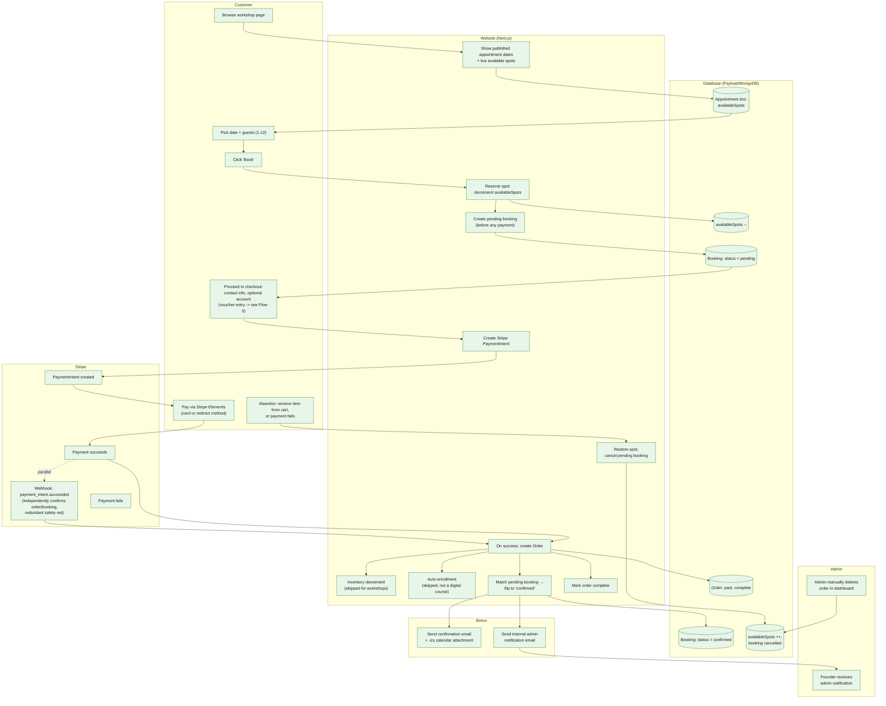

**Note:** voucher entry and redemption logic (including the partial-coverage bug) lives entirely in Flow 3 — not duplicated here to keep this diagram readable.

---

## Flow 2 — Gift voucher purchase

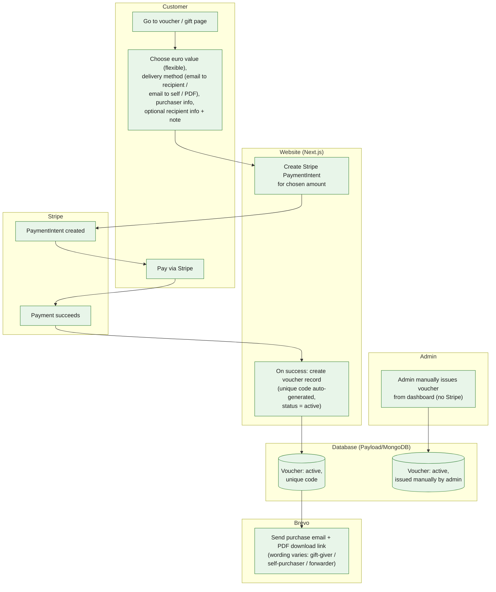

---

## Flow 3 — Redeeming a voucher at checkout

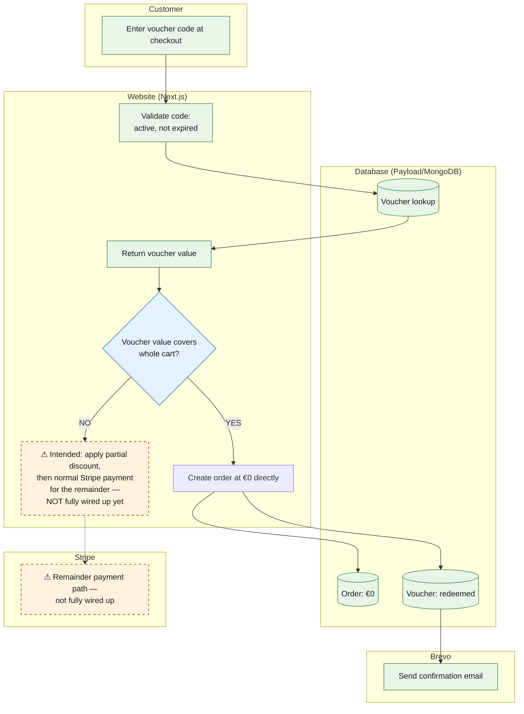

**⚠ Known bug:** when a voucher only partially covers the cart, the system has no working path today — no partial-discount-then-Stripe-payment flow exists in production.

---

## Flow 4 — PDF voucher download

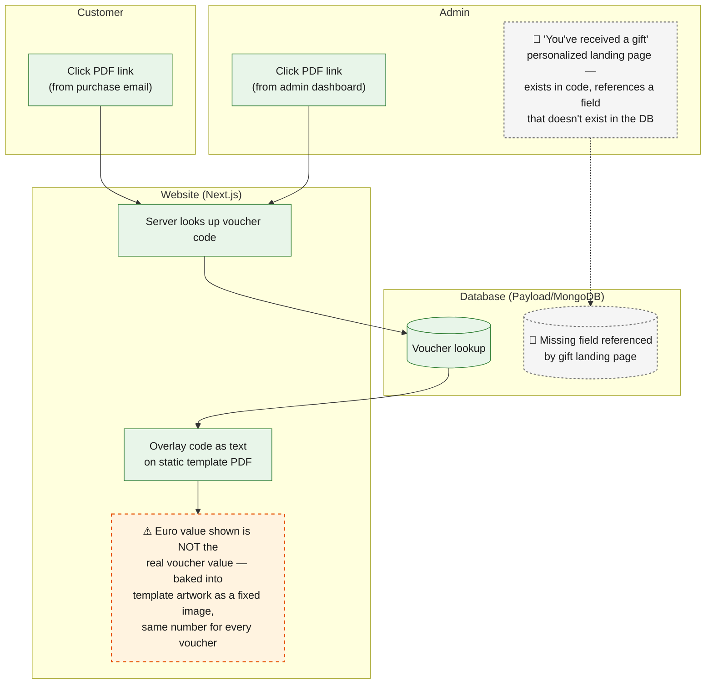

**⚠ Known bug:** PDF shows a fixed placeholder amount regardless of actual voucher value.
**🚧 Not built:** the personalized "gift received" landing page is non-functional (missing DB field).

---

## Flow 5 — Account creation, login, password reset

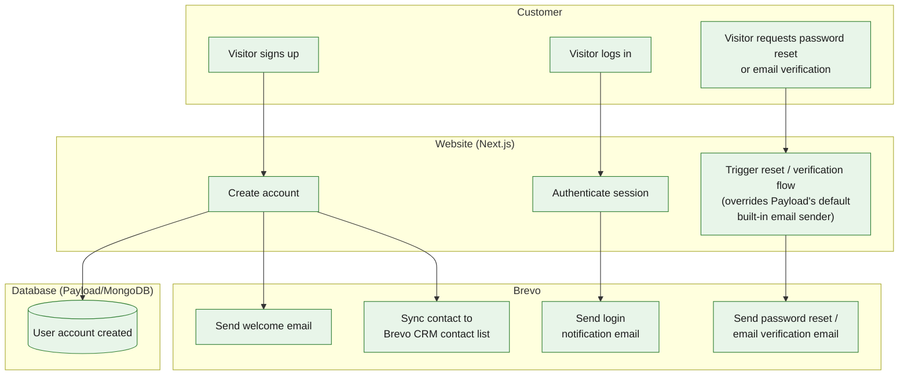

---

## Flow 6 — Newsletter signup

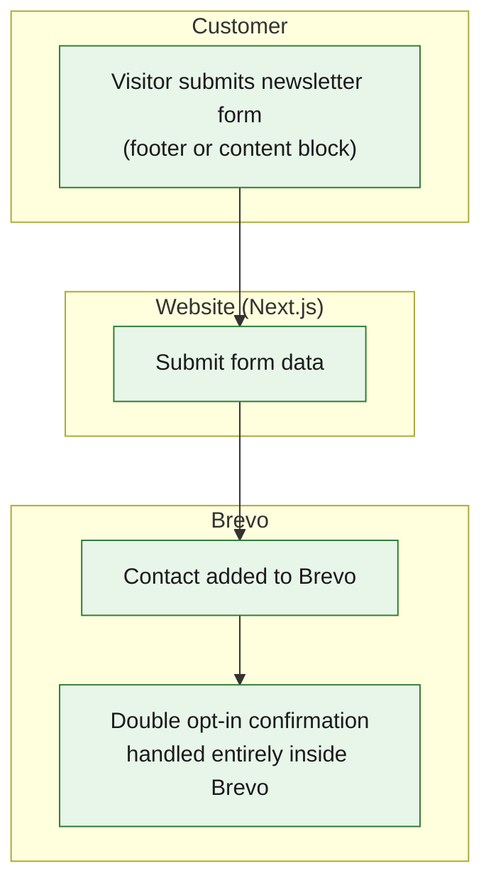

---

## Flow 7 — Digital course purchase & enrollment

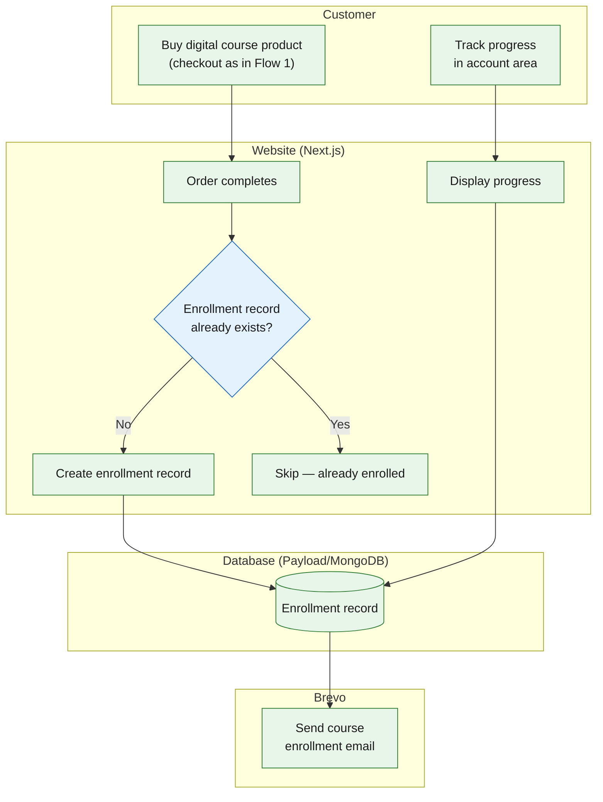

---

## Flow 8 — Admin: publishing a new workshop (no developer involved)

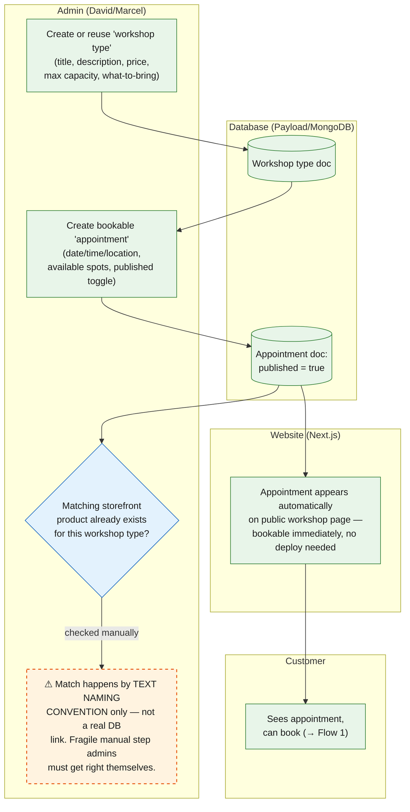

**⚠ Known bug / fragile:** product↔workshop matching relies on naming convention text-matching, not an enforced database relationship.

---

## Flow 9 — Editing website content (bilingual)

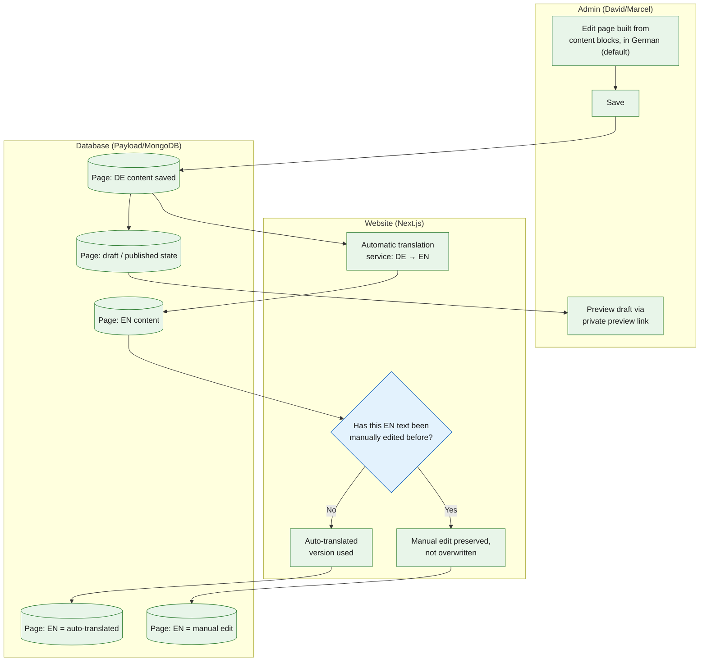

---

## Flow 10 — Stripe webhook reconciliation (background, runs independently of checkout)

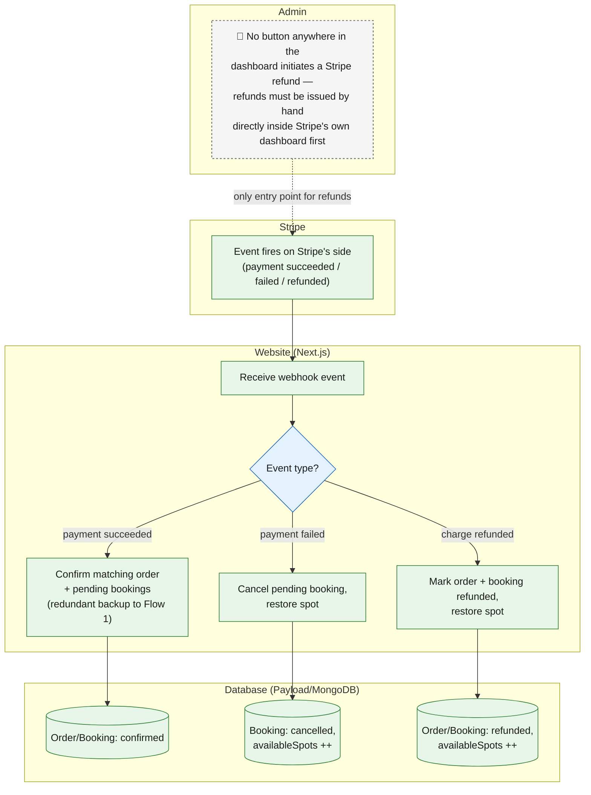

**🚧 Not built:** this reconciliation is the *only* refund automation that exists — there is no in-dashboard refund-initiation button; refunds start manually inside Stripe itself.

---

## Flow 11 — Cancelling or rebooking a workshop 🚧 (not built — proposed design, split into 4 scenarios)

None of this exists today — the single biggest gap versus every flow above. Based on David's operational use-case doc (Cases 1–4), this splits into four distinct scenarios rather than one generic "cancel" flow, because the right business response is different in each case. Shared principle across all four: **rebooking is tried first, credit/voucher second, cash refund only as a last resort** — this keeps revenue in the business and matches how comparable workshop operators handle it (see the refund policy research doc).

### Flow 11a — Admin cancels a full workshop date (David's Case 1)

Illness, scheduling conflict, or too few participants force a whole date to be pulled. Payments stay linked to the customer (nothing auto-refunds); everyone affected gets a magic-link invite to self-serve a new date, with manual admin rebooking as the fallback. Refund is offered only if no date works for the customer.

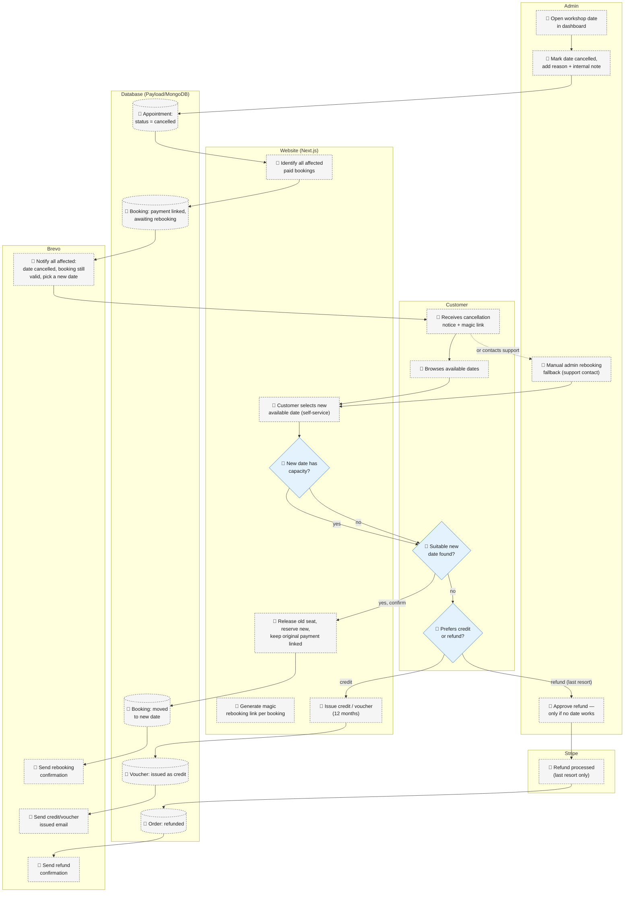

---

### Flow 11b — Individual reschedule, workshop unaffected (David's Case 2)

One customer has a personal conflict; the session itself still runs for everyone else. Self-service via a magic link in the original confirmation email, capacity- and window-gated, with admin manual rebooking as the fallback for edge cases (expired link, price difference).

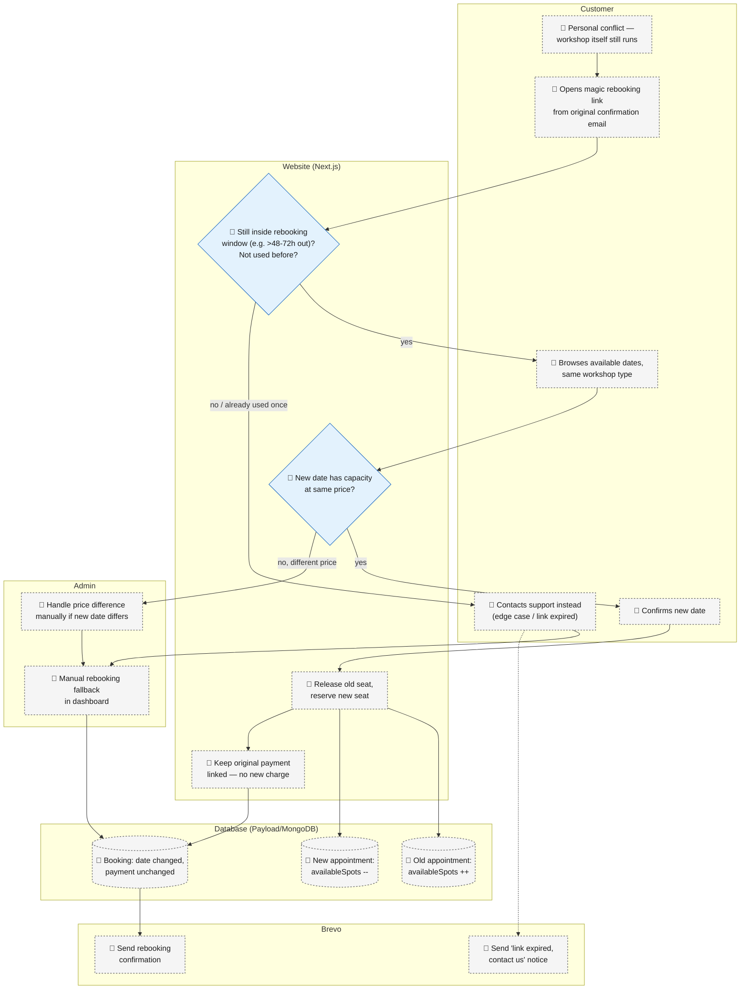

---

### Flow 11c — Customer cancels entirely: rebook → credit → refund waterfall (David's Case 3)

The customer doesn't want any date — a true cancellation. Resolution depends on the same policy tiers proposed in the refund policy doc: 7+ days out offers credit first (refund only if the customer insists), 3–6 days offers credit only (refund becomes a rare, discretionary admin exception), under 72h/no-show gets neither.

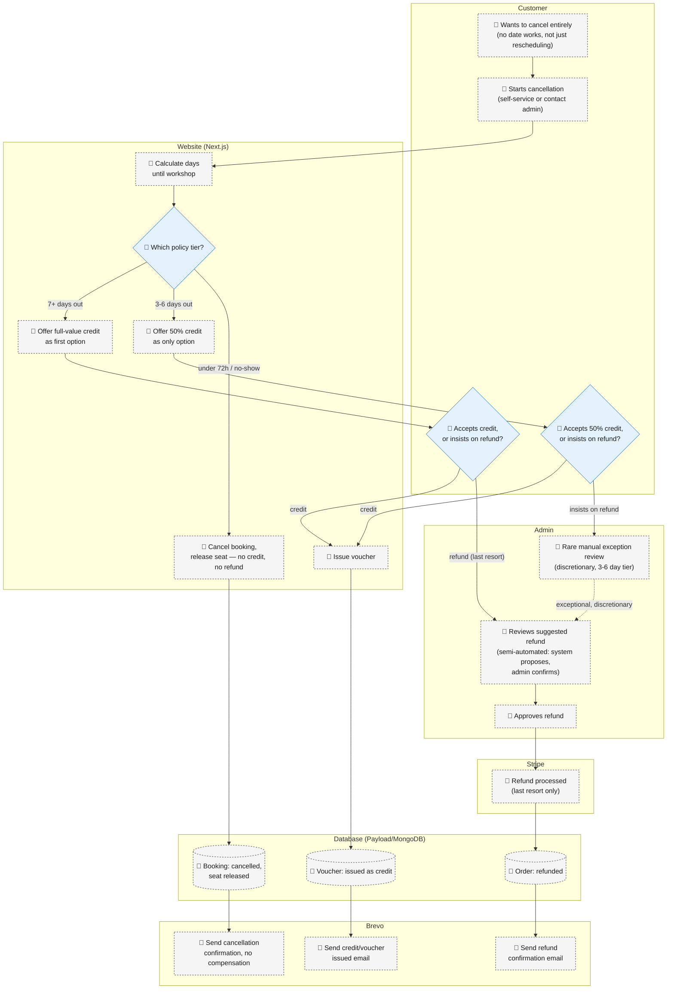

---

### Flow 11d — Partial cancellation of a multi-seat booking (David's Case 4)

Bookings hold 1–12 guests as a single quantity, not named individuals — so "one person out of a group of 3" reduces the quantity by one rather than cancelling the whole booking. MVP is admin-only (per David's suggested Option C); self-service can come later. The single removed seat's value follows the exact same rebook → credit → refund waterfall as Flow 11c, just scoped to one seat instead of the whole booking.

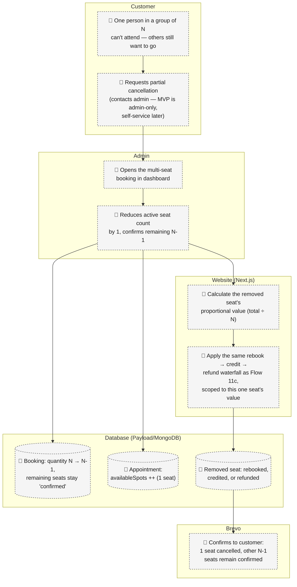

**🚧 Not built:** none of Flow 11a–11d exists today — the single biggest gap versus every flow above. These are the intended shapes, not current reality, and still need David & Marcel's sign-off on the underlying refund/credit policy before they're built as-is.

---

## Map of maps — all 11 flows, overall health

Each flow shown as a single node, color-coded by overall status, with arrows showing hand-offs between flows. Color call for each flow is Rafaela Studio's synthesis of the detail above — worth a gut-check against your own read before sharing externally.

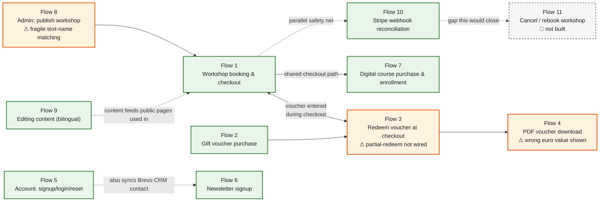

---

## Legend recap

| Style | Meaning |
| --- | --- |
| 🟩 Solid green box | Confirmed working today |
| 🟧 Dashed orange box | Exists but broken — "⚠ known bug" |
| ⬜ Dashed gray box | Referenced/planned but doesn't work — "🚧 not built yet" |
| 🔷 Diamond | Decision point |

**Biggest gaps at a glance:** no true remainder-payment path when a voucher partially covers a cart (Flow 3), voucher PDFs display a fixed placeholder amount (Flow 4), product↔workshop linking is a manual naming convention rather than an enforced relationship (Flow 8), and there is no cancellation/refund/rebooking workflow anywhere in the admin dashboard (Flow 11) — refunds today start by hand in Stripe itself.
